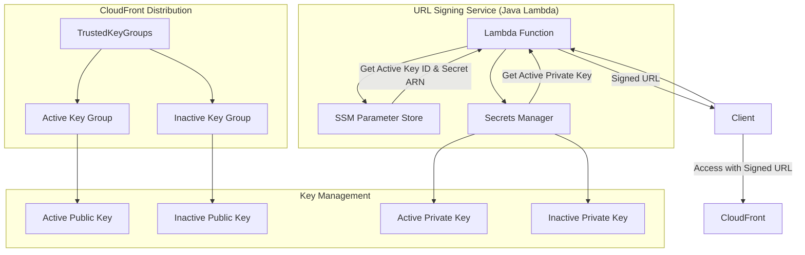
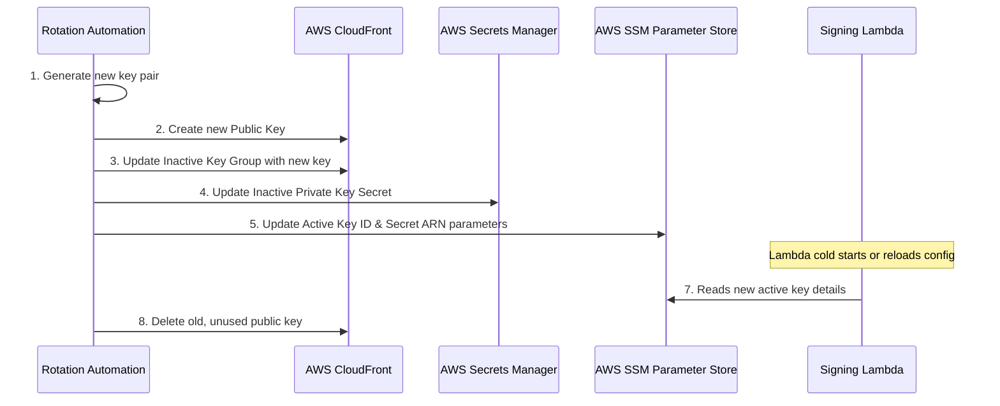

# CloudFront Signed URLs - Key Rotation Strategy

**Author:** Platform Engineering Team  
**Last Updated:** October 19, 2025

---

## 1. Overview

This document outlines a zero-downtime key rotation strategy for CloudFront signed URLs. The strategy is designed to enhance security by regularly rotating the cryptographic keys used to sign URLs, without causing any service disruption to end-users. The solution leverages multiple CloudFront key groups and an automated process to manage the lifecycle of active and inactive keys.

## 2. Guiding Principles

- **Zero Downtime:** Key rotation must not invalidate currently active signed URLs. Users with valid, unexpired URLs should not be affected during a rotation event.
- **Automation:** The rotation process should be automated to reduce operational overhead and minimize the risk of human error.
- **Security:** The strategy must adhere to security best practices, including the principle of least privilege and secure storage of private keys.
- **Auditability:** All key rotation events must be logged and auditable.

## 3. Proposed Architecture

The architecture employs an active/inactive key model, where two key pairs are managed simultaneously. The CloudFront distribution is configured to trust both key pairs, enabling seamless transitions during rotation.

### 3.1. Components

- **Two CloudFront Public Keys:**
  - `active-key`: The public key currently used to sign new URLs.
  - `inactive-key`: A new public key staged for the next rotation.

- **Two CloudFront Key Groups:**
  - `active-key-group`: Contains the `active-key`.
  - `inactive-key-group`: Contains the `inactive-key`.
  - The CloudFront distribution is configured to trust **both** key groups.

- **Two Secrets Manager Secrets:**
  - `active-private-key`: The private key corresponding to the `active-key`.
  - `inactive-private-key`: The private key corresponding to the `inactive-key`.

- **SSM Parameter Store:**
  - `/cloudfront-signer/active-key-id`: Stores the ID of the currently active public key (e.g., `K2PNHFE2BDB9MN`).
  - `/cloudfront-signer/active-secret-arn`: Stores the ARN of the secret containing the active private key.

- **Java Lambda Function:**
  - The Lambda function is responsible for generating signed URLs.
  - On initialization, it reads the active key ID and secret ARN from SSM Parameter Store.
  - It uses the retrieved active key to sign all new URL requests.

### 3.2. Architecture Diagram

## 4. Key Rotation Process

The key rotation process is designed to be executed automatically (e.g., every 90 days via a scheduled Lambda function or cron job) or triggered manually.

**Assumptions:**
- At the start, we have an `active-key` and an `inactive-key`.
- The CloudFront distribution trusts both corresponding key groups.
- The Lambda function is using the `active-key` for signing.

**Rotation Steps:**

1.  **Generate New Key Pair:**
    - A new RSA-2048 key pair is generated locally by the rotation script/Lambda.

2.  **Create New CloudFront Public Key:**
    - The public key from the new pair is uploaded to CloudFront, creating a `new-public-key`.

3.  **Update Inactive Key Group:**
    - The `inactive-key-group` is updated to remove its current public key and add the `new-public-key`.

4.  **Update Inactive Secret:**
    - The private key from the new pair is stored in the `inactive-private-key` secret in Secrets Manager, overwriting the old one.

5.  **Promote Inactive to Active:**
    - The SSM Parameter Store values are updated:
      - `/cloudfront-signer/active-key-id` is set to the ID of the `new-public-key`.
      - `/cloudfront-signer/active-secret-arn` is set to the ARN of the `inactive-private-key` secret.

6.  **Demote Active to Inactive:**
    - The roles are now swapped. The old `active-key` is now effectively the `inactive-key` because the Lambda will no longer use it for new signatures. The CloudFront distribution still trusts it, so old URLs remain valid.

7.  **Lambda Reloads Configuration:**
    - The Java Lambda function should be configured to periodically check the SSM Parameter Store for the active key details or be re-initialized to pick up the new configuration. A simple approach is to rely on Lambda cold starts, but a more robust solution would involve an in-memory cache with a short TTL (e.g., 5 minutes).

8.  **Cleanup Old Public Key:**
    - The public key that was previously in the `inactive-key-group` (and is now unused) can be safely deleted from CloudFront.

### 4.1. Rotation Flow Diagram

## 5. Implementation Details

### 5.1. Terraform Changes

- The Terraform configuration will be updated to manage two sets of resources:
  - `aws_cloudfront_public_key` (x2)
  - `aws_cloudfront_key_group` (x2)
  - `aws_secretsmanager_secret` (x2)
- The `aws_cloudfront_distribution` will be modified to include both key group IDs in its `trusted_key_groups` list.
- `aws_ssm_parameter` resources will be created to store the active key configuration.

### 5.2. Java Lambda Function

- The Lambda will use the AWS SDK for Java 2.x.
- It will include dependencies for `ssm`, `secretsmanager`, and the core Java cryptography libraries.
- A caching mechanism (e.g., Guava Cache) will be used to store the active key details in memory for a short period to reduce calls to SSM and Secrets Manager.

### 5.3. Automation Script

- A script (e.g., Python with `boto3` or a shell script with AWS CLI) will be created to orchestrate the rotation steps.
- This script can be executed manually or scheduled to run periodically.

## 6. Security Considerations

- **IAM Permissions:** The rotation script/Lambda will require permissions to manage CloudFront public keys, key groups, and Secrets Manager secrets. The signing Lambda will only require read access to SSM and the specific private key secret.
- **Private Key Handling:** Private keys should never be logged or exposed. They are generated and immediately stored in Secrets Manager.
- **Rotation Frequency:** A 90-day rotation period is recommended as a starting point, but this can be adjusted based on organizational security policies.

---

